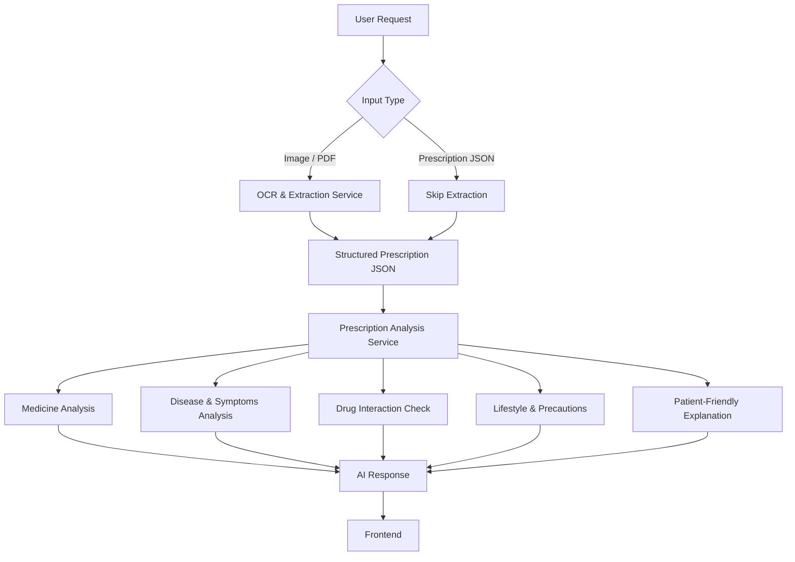
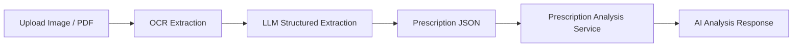
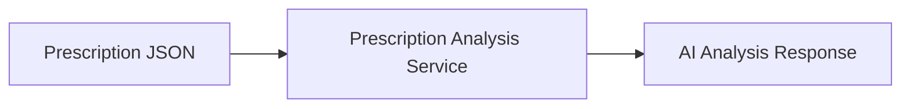
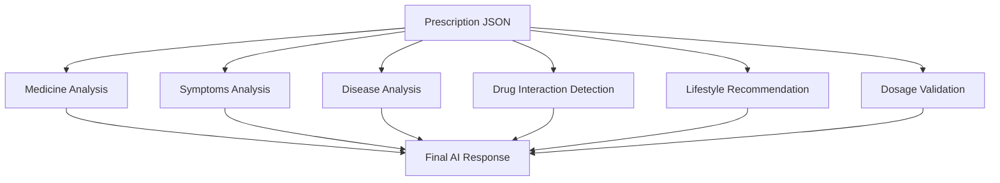
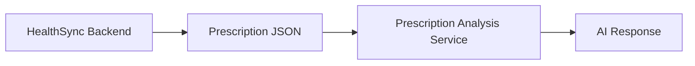
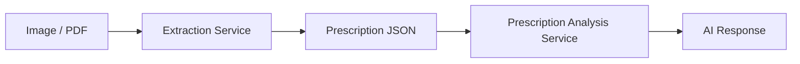

# Prescription Analysis Service

The **Prescription Analysis Service** analyzes medical prescriptions from either uploaded documents (Image/PDF) or structured JSON. It extracts prescription information into a standardized JSON format and then performs AI-powered medical analysis.

---

# Overview

The service supports two input formats:

1. **Image / PDF**
   - User uploads a prescription.
   - OCR extracts text.
   - LLM converts the extracted text into structured JSON.

2. **Prescription JSON**
   - Used when the prescription is already available (e.g., generated by HealthSync).
   - Extraction is skipped.

Both flows converge into a single analysis pipeline.

---

# System Architecture


---

# Image / PDF Flow



---

# Structured JSON Flow



---

# Extraction Service

Responsible for converting uploaded prescriptions into structured JSON.

## Responsibilities

- OCR from Images
- OCR from PDFs
- Medicine extraction
- Dosage extraction
- Frequency extraction
- Duration extraction
- Doctor's notes extraction
- Symptoms extraction
- Diagnosis extraction
- Schema validation

---

## Output Schema

```json
{
  "doctor": {
    "name": "Dr. John Doe",
    "specialization": "Cardiologist"
  },
  "patient": {
    "name": "John Smith",
    "age": 42,
    "gender": "Male"
  },
  "appointment": {
    "date": "2026-06-18"
  },
  "medicines": [
    {
      "name": "Paracetamol",
      "dosage": "500 mg",
      "frequency": "Twice Daily",
      "duration": "5 Days",
      "note": "After meals"
    }
  ],
  "symptoms": [],
  "diseases": [],
  "notes": []
}
```

---

# Analysis Service

Consumes the standardized Prescription JSON and produces AI-powered medical explanations.

## Responsibilities

- Explain medicines
- Explain dosage
- Explain frequency
- Explain duration
- Explain diagnosis
- Explain symptoms
- Explain doctor's notes
- Detect possible drug interactions
- Highlight precautions
- Suggest lifestyle changes
- Generate patient-friendly explanations

---

# Internal Analysis Pipeline



---

# Supported Inputs

| Input | Supported |
|--------|-----------|
| JPG | ✅ |
| JPEG | ✅ |
| PNG | ✅ |
| PDF | ✅ |
| Structured JSON | ✅ |

---

# HealthSync Integration

## HealthSync Generated Prescription

No OCR is required.



---

## External Prescription

OCR is performed before analysis.



---

# Advantages

- Single analysis pipeline
- Standardized JSON schema
- Reusable extraction module
- Supports HealthSync prescriptions
- Supports external prescriptions
- Easy backend integration
- Easy future extension
- Consistent AI output

---

# Future Enhancements

- Drug interaction detection
- Duplicate medicine detection
- Allergy warnings
- Medicine substitution suggestions
- Disease risk prediction
- Lab report analysis
- Follow-up recommendations
- Multilingual explanations
- Prescription quality scoring
- Medical timeline generation

---

# Tech Stack

- NestJS
- TypeScript
- OpenAI GPT
- OCR Engine (Tesseract / Vision Models)
- JSON Schema Validation
- REST APIs